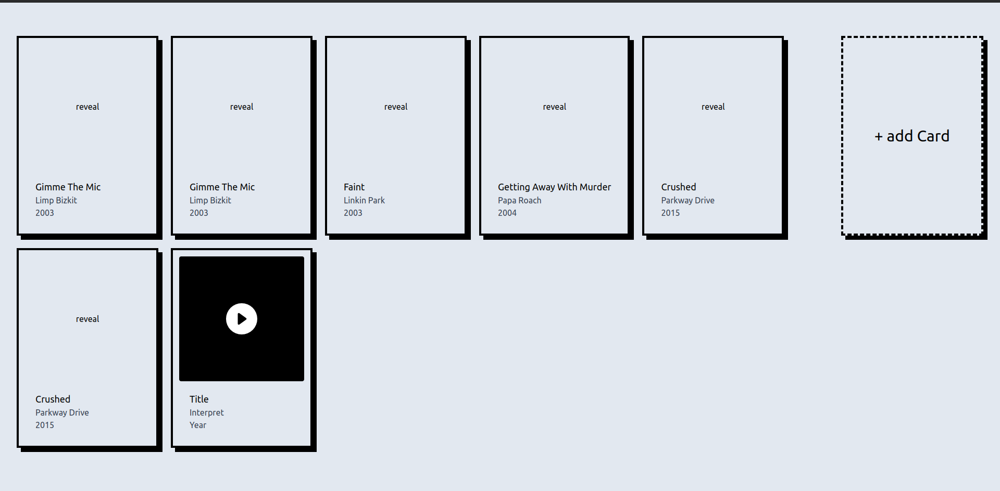

# WTF is BackInTime? 

> It is a web app written in [Golang](https://go.dev/), [Templ](https://templ.guide/) and [HTMX](https://htmx.org/) because I wanted to try out this stack. 

Actually it is a game in which you connect to your [Spotify](spotify.com) account and then basically have to guess the correct release year order of songs from any Spotify playlist you can provide.

